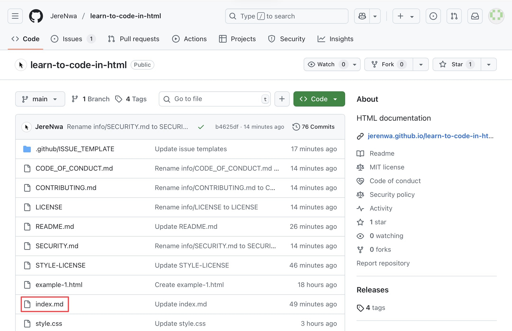
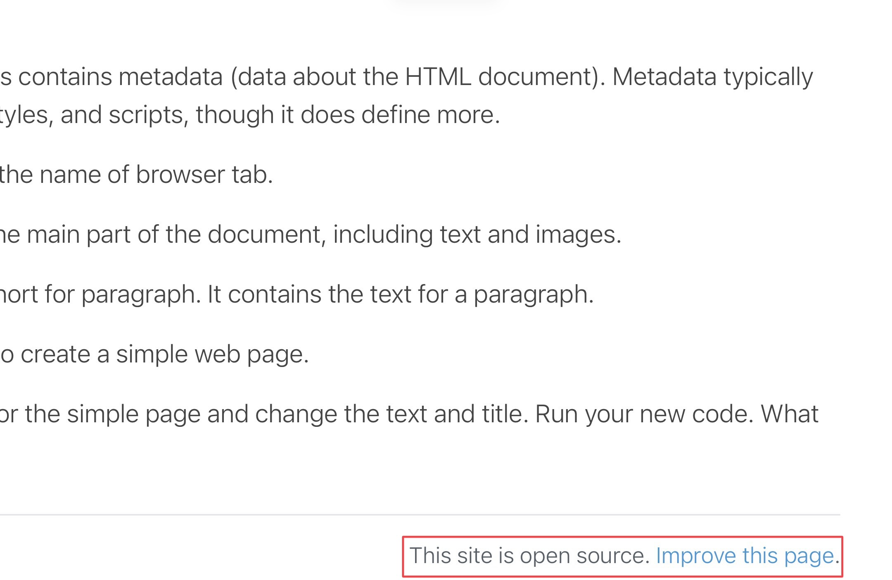
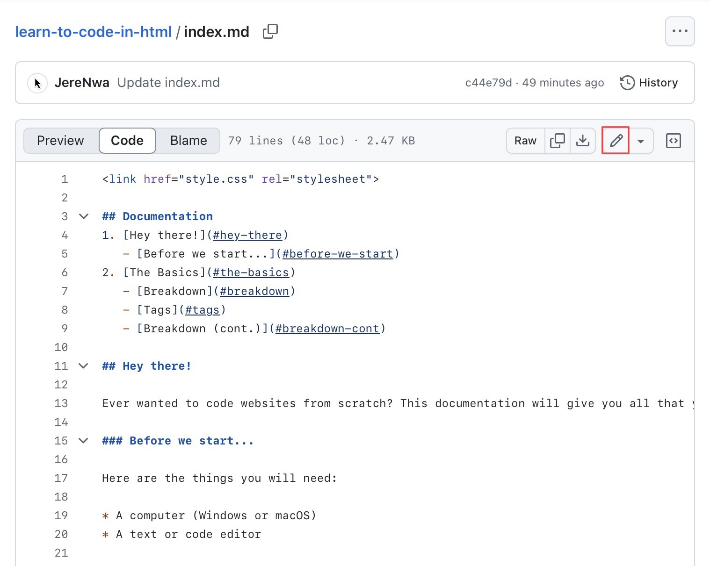
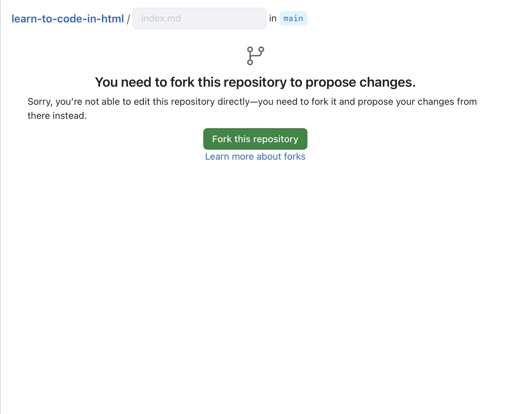

# How to contribute
1. Go to the repository page and click `index.md`.

**or** 

go to the bottom of the [GitHub Pages site](https://jerenwa.github.io/learn-to-code-in-html) and click 'Improve this page'.

2. Go to the Code tab, then click the edit icon (a little pencil) in the corner.

(Skip this step if you clicked 'Improve this page'.)

3. Click 'Fork this repository'.

4. Edit away! Don't forget to click the 'Commit changes...' button! Your changes will be checked by me, then will be added after my approval!
